# 15.4 Climate Warehouse Install Guide (Testnet)

### Note to Chia employees: This document is meant for internal consumption only. It assumes you're running on testnet10. It also assumes you have never previously installed Chia. If you already have keys and a database for testnet10, you can skip the steps for adding/downloading them. The final version of this doc will use mainnet.

### This website is a temporary home for this document. The permanent home of the mainnet version of this document will likely in the public wiki.

---

This document will guide you through the process of installing the Climate Warehouse application on Windows and MacOS. For additional technical resources, see the following:

- [Data Layer (Beta) RPC API](/docs/12rpcs/data_layer_rpc_api 'Section 12.3: Data Layer Beta RPC API')
- [Data Layer (Beta) CLI Reference](/docs/13cli/data 'Section 12.3: Data Layer Beta CLI Reference')

## Contents:

- Installation

  - [Install and configure Chia and the Data Layer (Beta) server](#install-and-configure-chia-and-the-data-layer-beta-server)
  - [Install the Climate Warehouse service](#install-the-climate-warehouse-service)
  - [Install and configure the Climate Warehouse Aux Application (GUI)](#install-and-configure-the-climate-warehouse-aux-application-gui)

- Using the Climate Warehouse
  - [Create a new Organization](#create-a-new-organization)
  - [Create a new project](#create-a-new-project)
  - [Create a new Unit](#create-a-new-unit)
  - [Connect to a remote node](#connect-to-a-remote-node)

---

## Install and configure Chia and the Data Layer (Beta) server

> Note: Your firewall might give warnings when installing both Chia and the Climate warehouse. This is normal. Allow the installations to continue.

1. We'll be running on Chia's testnet, so you can safely download a copy of the database. Do not attempt this on mainnet. [Click here to begin the download.](https://download.chia.net/testnet10/blockchain_v1_testnet10.sqlite.gz "Chia's testnet10 database download site") Save the file to your Downloads folder.

Note that the file you will download is around 10 GB, compressed. Uncompressed, it will be around 30 GB. Make sure you have at least this much free space, and ideally 50 GB. You can continue with the next steps while it is downloading.

2. Download the latest Chia installer (Atari branch) from Keybase Files in chia_network.datalayerdogfood.

3. Install Chia

Windows: \* Double click ChiaSetup-[version].exe. The installation process will take less than 30 seconds on most computers.

MacOS: \* Double click Setup-[version].dmg. Drag the Chia icon to the Applications folder.

<div class="figure">
  
  <div class="figcaption">
	<em>Windows installer (left) and MacOS installer (right).</em>
  </div>
</div><br/>

4. On Windows, the _Select Your Client Mode_ window will appear. We'll be using the Command Line Interface, so close this window. On MacOS this window doesn't appear, so no need to close it.

<div class="figure">
  
</div>

5. Open PowerShell on Windows, or Terminal on MacOS.

We'll create an alias to run the `chia` command from any folder.

Windows:

    * Run `Set-Alias -Name chia C:\Users\<username>\AppData\Local\chia-blockchain\app-<version>\resources\app.asar.unpacked\daemon\chia.exe`

    (Be sure to update &lt;username&gt; and &lt;version&gt; to match the actual folder structure.)

MacOS: \* Run `alias chia='/Applications/Chia.app/Contents/Resources/app.asar.unpacked/daemon/chia'`

6. MacOS only:

Run `chia init --fix-ssl-permissions`. This will update the permissions for Chia's SSL files.

```shell
~ % chia init --fix-ssl-permissions
@@@@@@@@@@@@@@@@@@@@@@@@@@@@@@@@@@@@@@@@@@@@@@@@@@@@@@@@@@@
@             WARNING: UNPROTECTED SSL FILE!              @
@@@@@@@@@@@@@@@@@@@@@@@@@@@@@@@@@@@@@@@@@@@@@@@@@@@@@@@@@@@
Permissions 0777 for '/Users/user/.chia/mainnet/config/ssl/ca/chia_ca.crt' are too open. Expected 0644
Permissions 0777 for '/Users/user/.chia/mainnet/config/ssl/ca/chia_ca.crt' are too open. Expected 0644
...
Finished updating SSL file permissions
No keys are present in the keychain. Generate them with 'chia keys generate'
```

7. Run `chia version`. You should be shown the correct version. For example:

```powershell
PS C:\Users\User> chia version
v1.2.12.dev671
```

8. Run `chia configure --testnet true`. This will set up Chia to use the testnet.

```powershell
PS C:\Users\User> chia configure --testnet true
Setting Testnet
Default full node port, introducer and network setting updated
Restart any running chia services for changes to take effect
```

9. Run `chia configure --set-log-level INFO`. This will instruct your Chia installation to log more info than it would have with the default level of WARNING.

```powershell
PS C:\Users\User> chia configure --set-log-level INFO
Logging level updated. Check C:\Users\User\.chia\mainnet/log/debug.log
Restart any running chia services for changes to take effect
```

10. Run `chia keys generate`. This will create a new public/private key pair.

```shell
PS C:\Users\User> chia keys generate
Generating private key
Added private key with public key fingerprint 3049838316
Setting the xch destination for the farmer reward (1/8 plus fees, solo and pooling) to txch1tsepaz2qx978sajarelw33ekee0uzrydw5gpxq42lrtf7c6a2rksy3lxp7
Setting the xch destination address for pool reward (7/8 for solo only) to txch1tsepaz2qx978sajarelw33ekee0uzrydw5gpxq42lrtf7c6a2rksy3lxp7
To change the XCH destination addresses, edit the xch_target_address entries in /Users/user/.chia/mainnet/config/config.yaml.
```

11. Run `chia keys show --show-mnemonic-seed`. You'll be shown your public and private keys. The last line of the output will be a list of 24 secret words. This is your _seed phrase_. **Carefully copy the words on paper and store them in a secure location.** Order is important.

```shell
PS C:\Users\User> chia keys show --show-mnemonic-seed
Showing all public and private keys

Fingerprint: 3049838316
Master public key (m): b976ead8b3fe50d6813d6073cc161fc020f399fc7789e55c0da944ad8b5d04da418159e5dc40e492258baf2ca5123278
Farmer public key (m/12381/8444/0/0): a5ec38213280c67c02733244c577f27f659b21ea70b347cbe8bb15c162e5d7d3c090b74d1e90a62734a1861531c5c86e
Pool public key (m/12381/8444/1/0): ab82d14faa38f179d096b7471578461a4712109cb2ebd31953e9b333356850c133c109eb767e9dfd75443f63f8979438
First wallet address: txch1tsepaz2qx978sajarelw33ekee0uzrydw5gpxq42lrtf7c6a2rksy3lxp7
Master private key (m): 4036ad6e56a1de925411bfce35aca18fc692950d99241466267b475730a834cc
First wallet secret key (m/12381/8444/2/0): <PrivateKey 2832e5f50dc5a092614e8627cf75f5fc378cc4c51db0932442f04b50fff338f1>
	Mnemonic seed (24 secret words):
youth stomach social aware clay pottery benefit asthma mail cry rubber panda wife around provide atom cute sand staff exotic pink east gloom minute
```

> **IMPORTANT**: Your seed phrase is all that is required to recover your wallet. If you lose your seed phrase, recovery will not be possible. If a bad actor gains access to your seed phrase, they'll be able to steal your Chia, including the singletons you'll use for the data layer. Do not take a picture of your seed phrase or store it on a computer.

12. Copy the value of "First wallet address:" from the output of the previous step. It will be a long string beginning with "txch". You'll use this wallet address in the next step.

> NOTE: If you ever need to display your address, run `chia keys show`. This command will only output your public keys and address; your private keys and seed phrase will not be shown.

13. You'll need some TXCH in order to use the Climate Warehouse. Open our [testnet faucet page](https://testnet10-faucet.chia.net "Chia's testnet10 faucet link"). Paste your address and click "Submit".

  <div class="figure">
	
  </div>

You'll receive this message: `Accepted. Your request is in the queue and will be processed in the order it was received.` At some point you'll receive 1 TXCH. Depending on how busy the faucet and the testnet are, this could take several minutes. However, you don't need to wait for your money to arrive before continuing.

14. Configure your router to forward ports 8575 (data propagation server) and 31310 (Climate Warehouse) to your local machine. To configure your router's settings, typically you'll need enter `http://192.168.1.1` in a web browser, though this address varies for different routers. From your router's settings, locate the Port Forwarding section and add a rule to forward ports 8575 and 31310 to your local IP address.

15. You'll also need to configure your firewall to allow connections on ports 8575 and 31310.

    Windows:

    - From a PowerShell prompt, run `Start-Process powershell -Verb runAs`. This will open a new PowerShell window as an Administrator. From this new window, you'll need to run four commands, two for incoming connections and two for outgoing connections.

    - `netsh advfirewall firewall add rule name="allowDataServerIn" dir=in action=allow protocol=TCP localport=8575`

    - `netsh advfirewall firewall add rule name="allowDataServerOut" dir=out action=allow protocol=TCP localport=8575`

    - `netsh advfirewall firewall add rule name="allowClimateWarehouseIn" dir=in action=allow protocol=TCP localport=31310`

    - `netsh advfirewall firewall add rule name="allowClimateWarehouseOut" dir=out action=allow protocol=TCP localport=31310`

    - Each of these commands should give a response of `Ok.` Once you have successfully run the commands, exit the Administrator PowerShell window.

    MacOS:

    - Open /etc/pf.conf in a text editor. You'll need administrative privileges. For example,

      `sudo vi /etc/pf.conf`

    - Add the following lines to the end of the file:

      ```bash
      # Open port 8575 for Chia Data Server
      pass in proto tcp from any to any port 8575
      # Open port 31310 for Climate Warehouse Server
      pass in proto tcp from any to any port 31310
      ```

    - Save and close the file.

    - Run `sudo pfctl -f /etc/pf.conf` to load the changes.

    - Run `sudo pfctl -sr | grep 8575` and `sudo pfctl -sr | grep 31310` to verify that the changes are active.

16. Run `mkdir ~/.chia/mainnet/db` to create the folder where your database will sit.

    ```powershell
    PS C:\Users\User> mkdir ~/.chia/mainnet/db

    Directory: C:\Users\User\.chia\mainnet

    Mode           LastWriteTime         Length Name
    ----           -------------         ------ ----
    d-----         2/18/2022   3:28 PM          db
    ```

17. You must wait for your database file to finish downloading before continuing. After the download has completed, use a zip manager such as [7-Zip](https://www.7-zip.org/ "7-Zip's website") to extract the file. You should now have a file in your Downloads folder called blockchain_v1_testnet10.sqlite.

run `mv ~/Downloads/blockchain_v1_testnet10.sqlite ~/.chia/mainnet/db` to move it to the folder you just created.

  <div class="figure">
	
	<div class="figcaption">
	<em>The blockchain database file in the correct location on Windows.</em>
  </div>
  </div>

18. Run `chia start wallet`. This command will start your daemon, wallet and full node.

```powershell
PS C:\Users\User> chia start wallet
Daemon not started yet
Starting daemon
chia_wallet: started
chia_full_node: started
```

19. Run `chia start data` to start the Data Layer Beta server.

```powershell
PS C:\Users\User> chia start data
chia_data_layer: started
```

20. Run `chia wallet show` to show your balance. You'll need to wait for `Sync status:` to say `Synced`. This will take a few minutes. After your wallet has synced, hopefully it will show a balance of 1.0 TXCH, which you requested from the faucet. If not, contact a Chia engineer and they can send you some TXCH.

```powershell
PS C:\Users\User> chia wallet show
Wallet height: 588320
Sync status: Synced
Balances, fingerprint: 318577323
Wallet ID 1 type STANDARD_WALLET Chia Wallet
	-Total Balance: 1.0 txch (1000000000000 mojo)
	-Pending Total Balance: 1.0 txch (1000000000000 mojo)
	-Spendable: 1.0 txch (1000000000000 mojo)
```

21. Chia uses the coin set (similar to UTXO) model of accounting. In the example above, the wallet contains 1 coin worth 1 TXCH. However, several coins are needed in order to configure the Climate Warehouse. To fix this, send yourself some money, and include a small fee so the transaction gets processed quickly. The format for this command is `chia wallet send -i <wallet ID, usually 1> -a <amount in TXCH> -m <fee in TXCH> -t <your own TXCH address> -f <your fingerprint>`.

For example, the following command will create a new coin worth 0.25 TXCH, with a 0.001 TXCH fee:

```powershell
PS C:\Users\User> chia wallet send -i 1 -a 0.25 -m 0.001 -t txch16f8puxdnxh7vhsc4l5e2pjvudzxhjxe5k7rd4c2xynpvunvcc2rq7rjcjy -f 318577323
Submitting transaction...
Transaction submitted to nodes: [('cb355777f896bd81b94e259cb073981d888b3e577e482fd074e3d22804056549', 1, None)]
Do chia wallet get_transaction -f 318577323 -tx 0x21e6c640bd53ba1b5839cda6c984db81bf8f10fa4a6e369889490de5e9d8afc4 to get status
```

Run a similar command three times, waiting about two minutes between each time. You will end up with four coins in your wallet.

22. Finally, run `chia show -s` to check the status of your node. It should say `Full Node Synced`.

```powershell
PS C:\Users\User> chia show -s
Network: testnet10    Port: 58444   Rpc Port: 8555
Genesis Challenge: ae83525ba8d1dd3f09b277de18ca3e43fc0af20d20c4b3e92ef2a48bd291ccb2
Current Blockchain Status: Full Node Synced
...
```

Chia is now installed and configured properly. Next you'll install the Climate Warehouse.

---

## Install the Climate Warehouse service

1. Visit Chia's [Climate Warehouse download site](https://github.com/Chia-Network/climate-warehouse/releases/latest). Download the zip file according to your OS.

2. Install the Climate Warehouse

Windows:

     * Extract `windows-x64-<version>.zip` to the folder you want to run the Climate Warehouse from.

  <div class="figure">
	
	<div class="figcaption">
	<em>The contents of windows-x64.zip.</em>
	</div>
  </div>

    * Open a PowerShell window, change to the `windows-x64` folder, and run `climate-warehouse.exe`. The application will begin polling for updates.

      ```powershell
      PS C:\Users\User> cd C:\Users\User\Downloads\ClimateWarehouse\windows-x64
      PS C:\Users\User\Downloads\ClimateWarehouse\windows-x64> .\climate-warehouse.exe
      Start Datalayer Update Polling
      Syncing PickLists
      Subscribing to default organizations
      (node:7588) Warning: Setting the NODE_TLS_REJECT_UNAUTHORIZED environment variable to '0' makes TLS connections and HTTPS requests insecure by disabling certificate verification.
      (Use `climate-warehouse --trace-warnings ...` to show where the warning was created)
      Mirror DB not connected
      ...
      Mirror DB not connected
      Connected to database
      Polling For Updates \
      ```

MacOS:

    * Double click `ClimateWarehouse-macos-installer-x64.pkg` to run the installer. Choose the default settings. When the installation process completes, close the installer.

  <div class="figure">
	  
	  <div class="figcaption">
		<em>The final panel of the Climate Warehouse installer.</em>
	  </div>
  </div>
  
  * Open a Terminal window, change to the `~/ClimateWarehouse` folder, and run `./climate-warehouse`. The application will begin polling for updates.

```shell
~ % cd ~/ClimateWarehouse
ClimateWarehouse % ./climate-warehouse
Start Datalayer Update Polling
Syncing PickLists
Subscribing to default organizations
(node:29004) Warning: Setting the NODE_TLS_REJECT_UNAUTHORIZED environment variable to '0' makes TLS connections and HTTPS requests insecure by disabling certificate verification.
(Use climate-warehouse --trace-warnings ... to show where the warning was created)
Mirror DB not connected
...
Mirror DB not connected
Connected to database
Polling For Updates \
```

3. To create your organization from the CLI (Can also be done later from the GUI):

   - Windows: Download and install [Git for Windows](https://gitforwindows.org/ 'Git for Windows website') (GitBash). Run the application, which looks similar to the Windows command prompt.

   - MacOS: Open a normal Terminal window.

4. Create your organization

   - Run the following command to create a new organization.

   ```powershell
   curl --location --request POST 'localhost:31310/v1/organizations' \
     --header 'Content-Type: application/json' \
     --data-raw '{
     "name": "<Your Org Name>",
     "icon": "<Icon URL>"
     }'
   ```

   Be sure to replace &lt;Your Org Name&gt; and &lt;Icon URL&gt;. If you don't have an icon URL, you can use our default: `https://climate-warehouse.s3.us-west-2.amazonaws.com/public/orgs/me.svg`

   If the command succeeds, you'll receive this message: `"New organization created successfully"`, along with an orgId. For example:

   ```bash
   ~ $ curl --location --request POST 'localhost:31310/v1/organizations' --header 'Content-Type: application/json' --data-raw '{
   "name": "Test Org",
   "icon": "https://climate-warehouse.s3.us-west-2.amazonaws.com/public/orgs/me.svg"
   }'
   % Total    % Received % Xferd  Average Speed   Time    Time     Time  Current
   								 Dload  Upload   Total   Spent    Left  Speed
   100   238  100   127  100   111    112     98  0:00:01  0:00:01 --:--:--   211{"message":"New organization created successfully.","orgId":"7c256cee3b1bda974259ae5e887bcd5b86c88bc49e353aaf3533a7823d93be42"}
   ```

5. Get your root hash

   - To verify your local organization, you can query its root hash by running `chia data get_root --id=<orgId>`, using the `orgId` from the previous command:

   ```powershell
   PS C:\Users\User> chia data get_root --id=7c256cee3b1bda974259ae5e887bcd5b86c88bc49e353aaf3533a7823d93be42
   {'confirmed': True, 'hash': '0x1714ec438ddb0846425a1e47352b5e17e723d9ce27924ed0c5cec338c7a56b69', 'success': True, 'timestamp': 1645404216}
   ```

---

## Install and configure the Climate Warehouse Aux Application (GUI)

1. Visit Chia's [Climate Warehouse Aux Application download site](https://github.com/Chia-Network/climate-warehouse-ui/releases/latest). Download the appropriate installer for your OS:

- Windows -- `Climate.Warehouse.Setup.<version>.exe`
- MacOS -- `Climate.Warehouse-<version>-universal.dmg`

2. Install the Climate Warehouse Aux Application

   Windows:

   - Double click `Climate.Warehouse.Setup.<version>.exe`. The application will be installed automatically and will create a Desktop icon called `Climate Warehouse`. The application will launch automatically.

   MacOS:

   - Double click `Climate.Warehouse-<version>-universal.dmg`. The application will install automatically. You'll need to drag the `Climate Warehouse` icon to the `Applications` folder.

<div class="figure">
	  
	  <div class="figcaption">
		<em>Drag the Climate Warehouse icon to complete the installation.</em>
	  </div>
</div><br/>

- Open the `Applications` folder and double click `Climate Warehouse` to run the application.

3. Initially, there will be no projects in the Climate Warehouse.

<div class="figure">
  
</div>

You have successfully installed the Climate Warehouse. The rest of this document will show you how to create an organization, create a new project, create a new unit, and connect to a remote node.

---

## Create a new Organization

1. If you have not yet created your organization, you'll need to do so now. Click "+ Create Organization".

<div class="figure">
  
</div><br/>

2. Fill in your Organization Name and Icon URL, as they are required fields. If you don't have an icon URL, you can use our default: `https://climate-warehouse.s3.us-west-2.amazonaws.com/public/orgs/me.svg`

<div class="figure">
  
</div><br/>

3. Click `OK`. You should be informed that your organization was successfully added. You will also be given an Organization ID.

<div class="figure">
  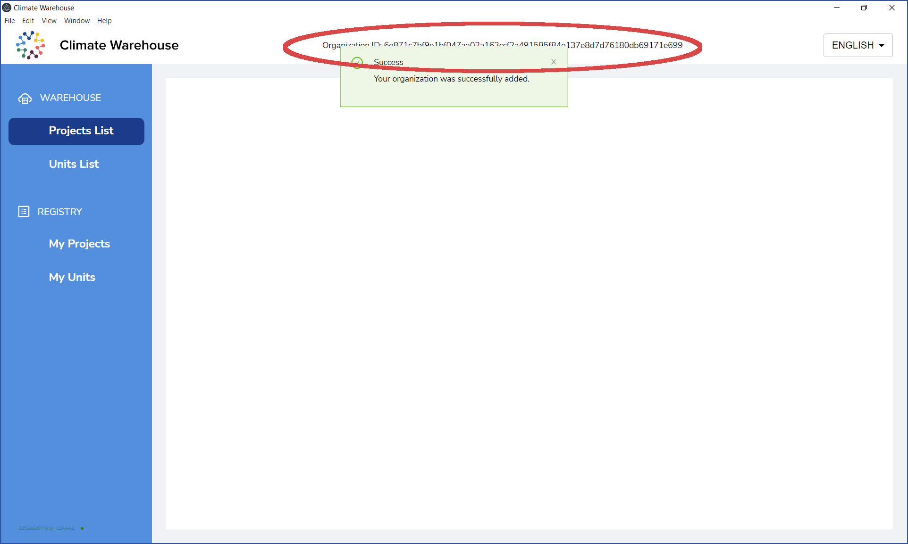
</div>

---

## Create a new project

1. To create a new project, click `My Projects`, then click `+ Create`:

<div class="figure">
  
</div><br/>

2. Fill in the required fields.

<div class="figure">
  
</div>
  
	* Required Field

- \*Project Name -- The name of the project.
- \*Project ID -- Identifier used to track the project in the current registry.
- \*Project Developer -- Enter the name(s) of the developer(s) associated with this project, separating each with a comma.
- Program -- Use this field to categorize the project into a specific program, if applicable.
- \*Project Link -- Place a URL link to the project website or website that hosts the project and its descriptions.
- \*Sector -- Select the industry sector which the project is associated with.
- \*Project Type -- Select the corresponding type to describe the project.
- \*Project Status -- Select the status that best describes the current state of the project.
- \*Project Status Date -- Enter the date that corresponds to the above status selection.
- \*Covered by NDC -- Select whether the project is covered by Nationally Determined Contributions.
- NDC Information -- Add text description to show how the project falls under NDC.
- \*Current Registry -- Name of the registry that currently hosts the project.
- \*Registry of Origin -- The registry that originally hosted the project. If it is the same as the current registry, please list the registry again.
- \*Origin Project ID -- Identifier used to track the project in the registry that first held this project. If it is the same as the Project ID, please list the project ID again.
- \*Unit Metric -- Select the metric that best describes the mitigation outcomes achieved by this project.
- \*Methodology -- Select the methodology that is being used to evaluate the project.
- Validation Body -- Select the validation organization that is, or will, validate the project.
- Validation Date -- Enter the date when a validation was granted to the project.
- Project Tags -- Add any tags, separated by commas, to apply to this project. This can capture information not shown in other fields.
  <br/><br/>The rest of the steps in the registration form allow you to add optional information.

3. When you reach Step 8, click Create Project.

<div class="figure">
  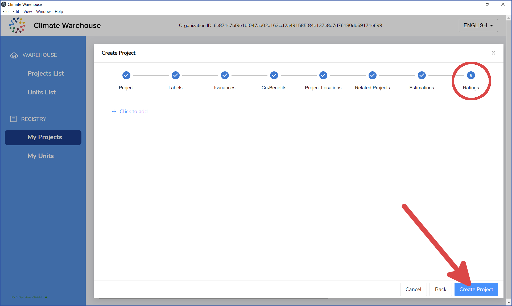
</div><br/>

4. You'll receive a message that the project was successfully created. Your project will be held in `STAGING` until you click the `Commit` button.

<div class="figure">
  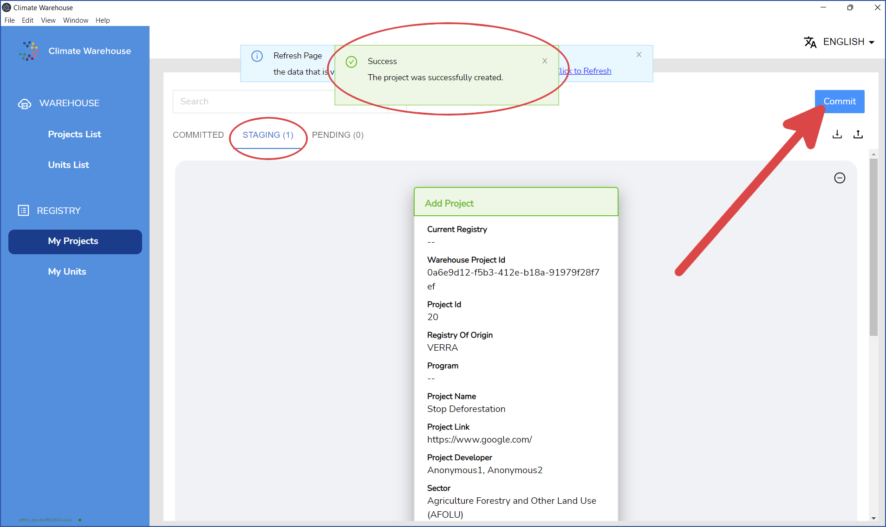
</div><br/>

5. After you click the `Commit` button, the `Commit Message` dialog will appear. If you have Units in the staging state, click `Everything`. Otherwise, clicking `Only Projects` will suffice.

<div class="figure">
  
</div><br/>

6. You'll receive a message that the transactions have been committed. They will now be `PENDING`.

<div class="figure">
  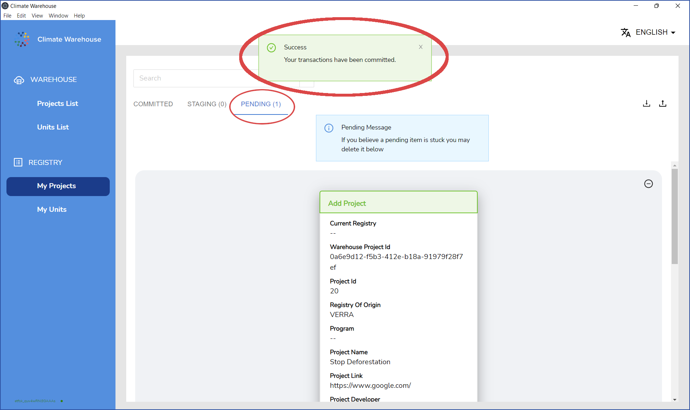
</div><br/>

7. The blockchain will confirm the transactions after a few minutes. You'll receive a message that your data may be out of date. Click the message to refresh the Climate Warehouse.

<div class="figure">
  
</div><br/>

8. Your project should now be visible.

<div class="figure">
  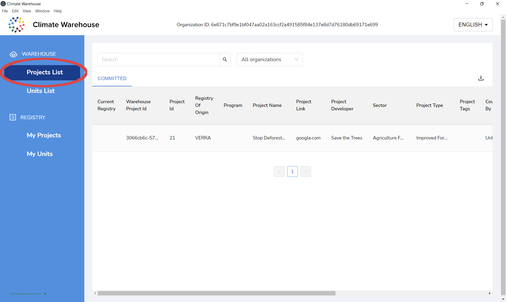
</div>

You have successfully created your new project.

---

## Create a new Unit

1. To create a new unit, click `My Units`, then click `+ Create`:

<div class="figure">
  
</div><br/>

2. Fill in the required fields.

<div class="figure">
  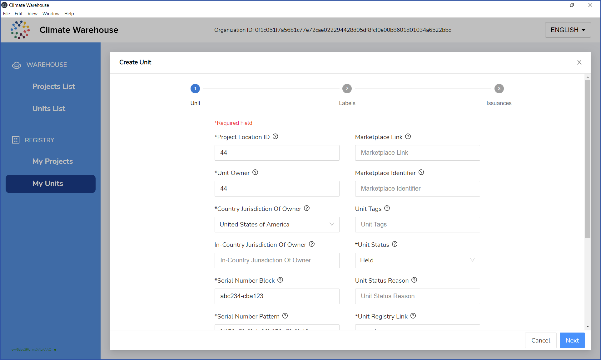
</div>
	
	* Required Field

- \*External Project Location ID -- Enter the location from which the particular block of units derives. This could be the same as the project location or it might be a more specific location within the project.
- \*Unit Owner -- Enter the name of the organization that currently owns the specific set of units issued.
- \*Serial Number Pattern -- If the serial number format is different from what your organization typically uses, please enter the format here.
  > **Note: It is very important to use a well-formed regex pattern.** The default pattern of `[.*\D]+([0-9]+)+[-][.*\D]+([0-9]+)$` will allow a combination of letters and numbers with a hyphen separating them, such as `abc100-abd105` and `abcde1-a12345`.
- \*Serial Number Block -- Enter the serial number block.
- In-Country Jurisdiction Of Owner -- If applicable, enter the region within the country selected above.
- \*Country Jurisdiction Of Owner -- Select the country which has jurisdiction over the set of units issued.
- \*Unit Type -- Select the type that best describes the units produced.
- \*Unit Status -- Select the status that best describes the current state of the units.
- \*Unit Status Reason -- Enter the appropriate reason for the status. If no reason is needed, simply enter 'N/A'.
- \*Unit Registry Link -- Enter the URL which links to the registry which hosts the units.
- \*Vintage Year -- Enter the year in which the units were awarded.
- Marketplace -- Select, or manually enter, the market on which the units are listed, if applicable.
- Marketplace Identifier -- Enter the unique identifier being listed on the marketplace which corresponds to the units in question, if applicable.
- Marketplace Link -- Enter the URL which links to the marketplace which the unit is being sold, if applicable.
- \*Corresponding Adjustment Declaration -- Select whether the units have a corresponding adjustment capability or not.
- \*Corresponding Adjustment Status -- Select the corresponding status of the corresponding adjustment.
- Unit Tags -- Enter additional information, separated by a comma, to track any additional notes against these units not already submitted in previous fields.

<br/>The rest of the steps allow you to add optional information.

3. When you reach Step 3, click Create.

<div class="figure">
  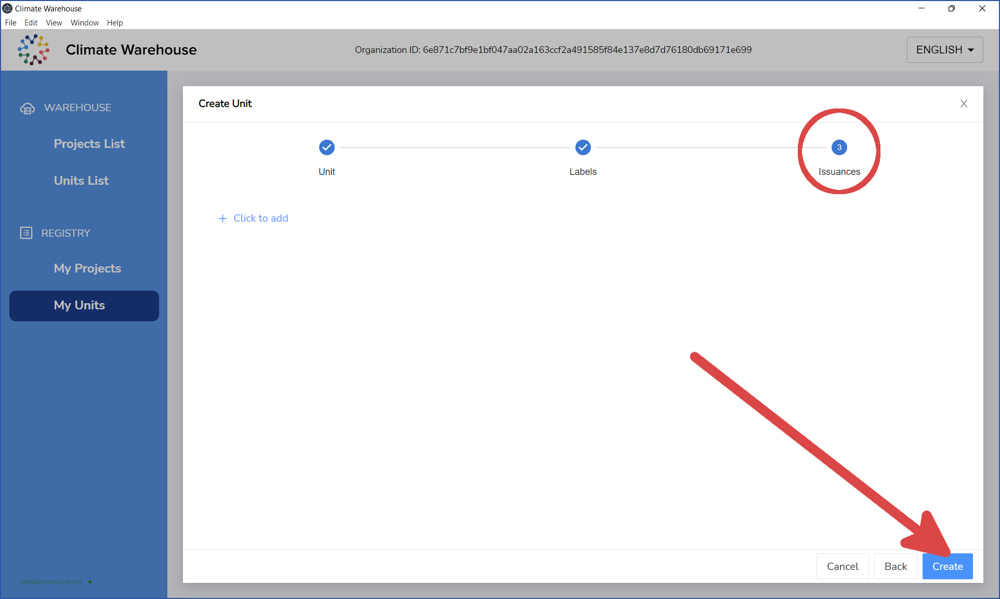
</div><br/>

4. You'll receive a message that the unit was successfully created. Your unit will be held in `STAGING` until you click the `Commit` button.

<div class="figure">
  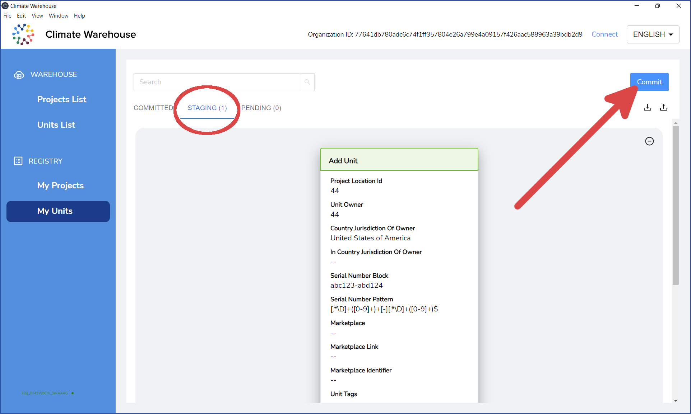
</div><br/>

5. After you click the `Commit` button, the `Commit Message` dialog will appear. If you have Projects in the staging state, click `Everything`. Otherwise, clicking `Only Units` will suffice.

<div class="figure">
  
</div><br/>

6. You'll receive a message that the transactions have been committed. They will now be `PENDING`.

<div class="figure">
  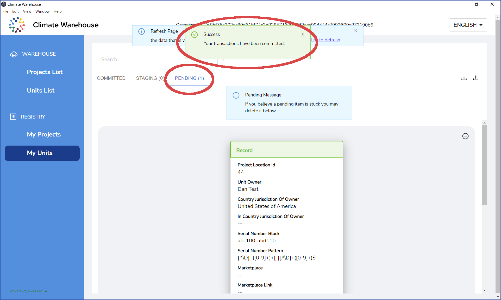
</div><br/>

7. The blockchain will confirm the transactions after a few minutes. `No pending data at this time` will be displayed.

<div class="figure">
  
</div><br/>

8. Either refresh the GUI or click `My Projects` and click `My Units` again. Your unit will now be listed in the COMMITTED tab.

<div class="figure">
  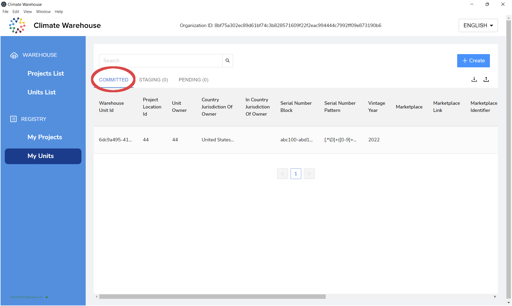
</div>

You have successfully created your new unit.

---

## Connect to a remote node

1. To connect to a remote node, first you must have created your organization. After you have done so, the `Connect` button will appear. Click this button to get started.

<div class="figure">
  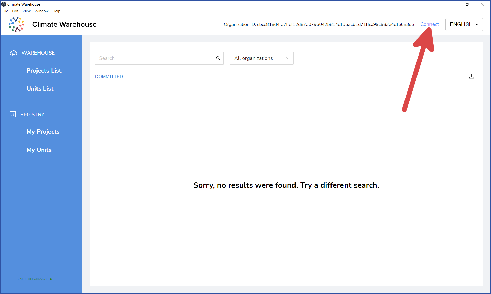
</div><br/>

2. The `Log in to remote node` dialog will appear. Fill in a valid server address and API key for the remote node and click `Connect`.

<div class="figure">
  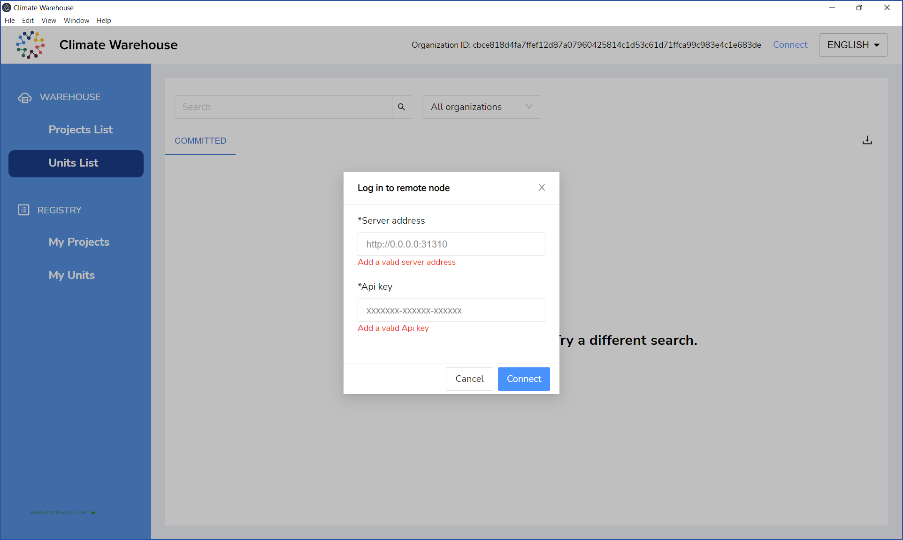
</div><br/>

3. You will now be connected to the remote node. You'll be able to view that node's projects and units. If you would like to disconnect, click the `Disconnect` button.

<div class="figure">
  
</div><br/>

4. Click any project for a detailed view, including any locations, labels, co benefits, estimations etc which may exist.

<div class="figure">
  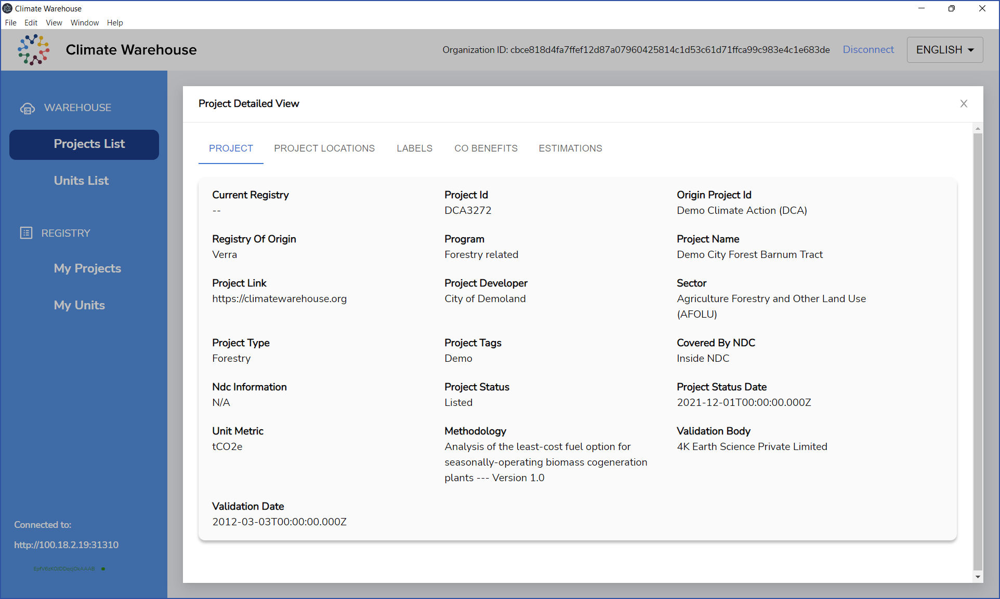
</div>
