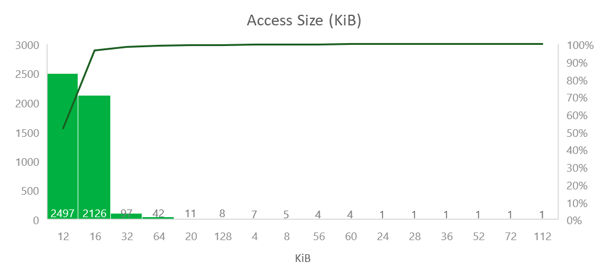
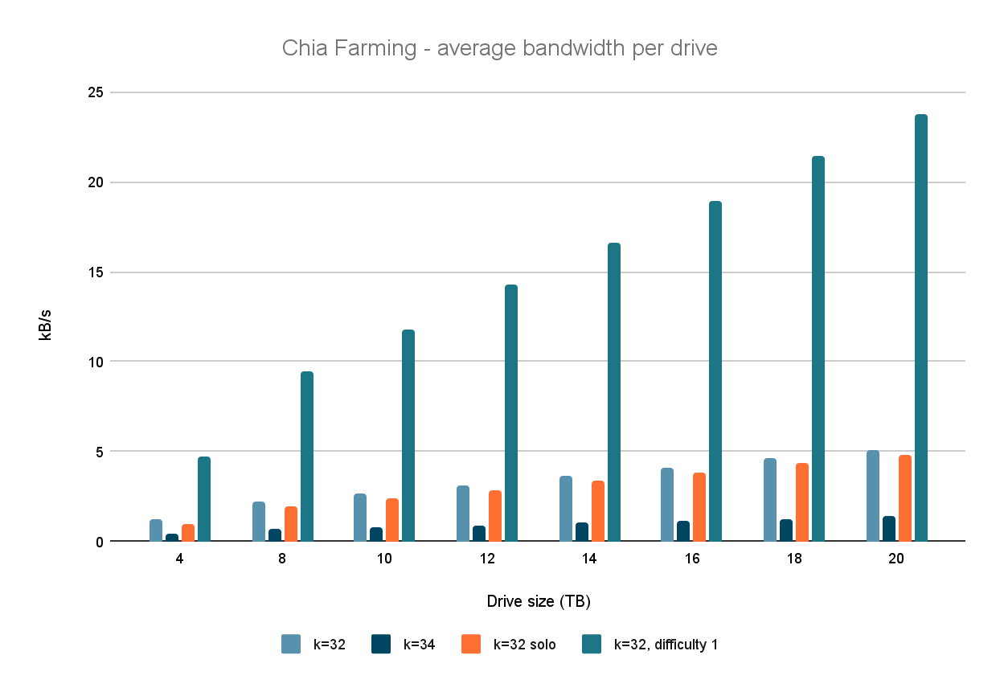
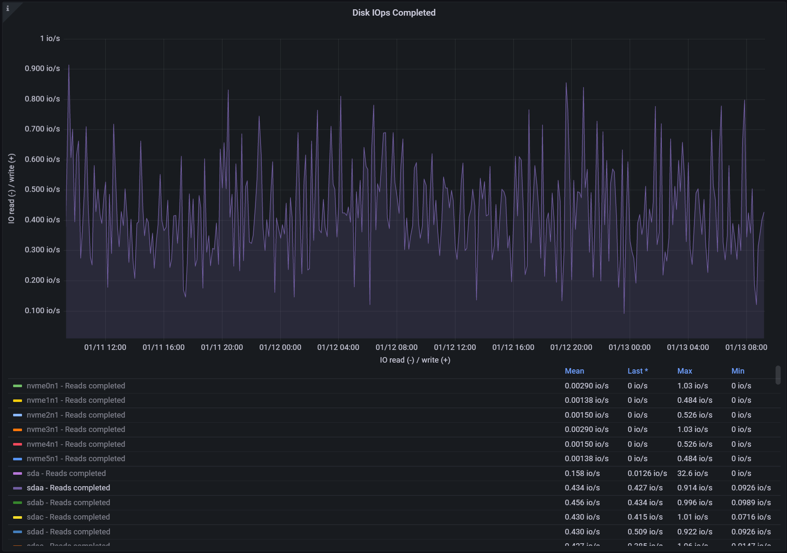
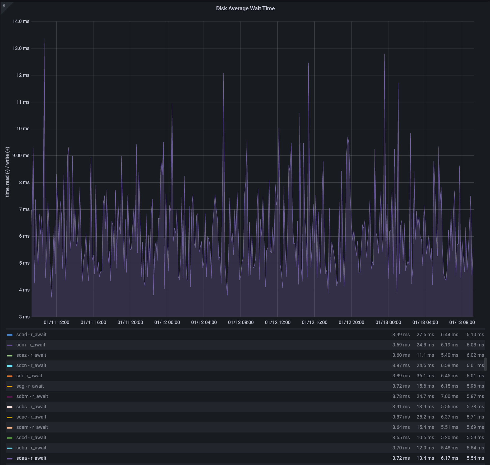
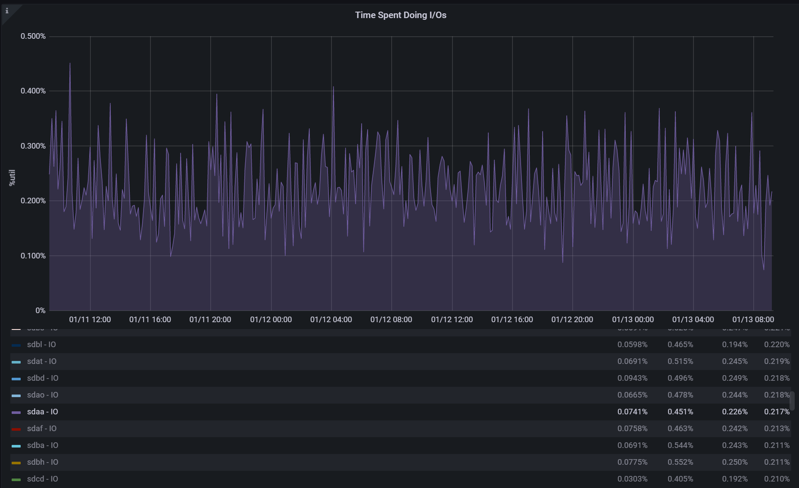
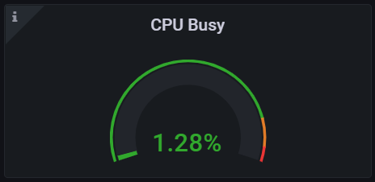
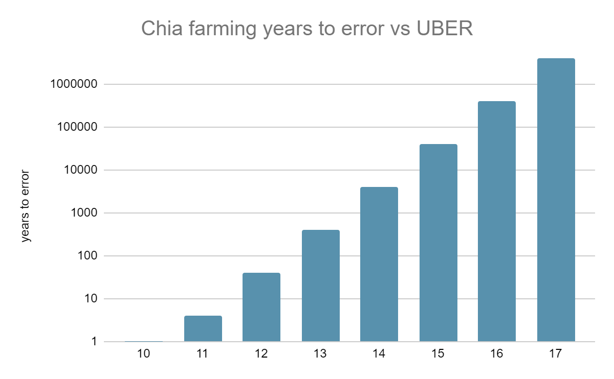

Jonmichael Hands, VP Storage, Chia Network. For comments and questions reach out to @LebanonJon on [Discord](https://discorg.gg/chia), or [@LebanonJon](https://twitter.com/LebanonJon) on Twitter

[Model](https://docs.google.com/spreadsheets/d/1AJP8j673qfbxxju87SjGs174DMVFpzjS/edit?usp=sharing&ouid=108662600751303250659&rtpof=true&sd=true) in Excel

## 摘要

Chia uses a consensus called proof of space and time, in which participants prove to the network that they are storing a certain amount of data through a process called farming.

Farmers respond to network challenges to earn rewards for securing the Chia network, which involves generating proofs of space from stored data. The protocol for farming and harvesting was designed for quick and efficient verification of proofs of space while minimizing disk io (input/output). A harvester service checks plot files for partial proofs of space when a challenge is received. There is a plot filter designed to significantly reduce the amount of disk io required by requiring that a hash of the plot id and challenge contains a certain amount of zeros. We will explore the theoretical disk io requirements based on the protocols, and look at measured disk utilization during a real farming workload. The Chia farming workload differs from traditional enterprise or consumer storage use cases since the data stored in plot files contains no user data. The Chia farming workload is read-only, completely random distribution, and a low amount of data transferred between the device and host. Data durability (defined as the probability of not losing user data) and error rate requirements for Chia are significantly reduced compared to storing user data and may constitute a new class of storage media and promote used hardware that otherwise would not be suitable.

## Proof of space verification

The proof of space construction and the [Proof of Space page](/chia-blockchain/consensus/proof-of-space-1.0) contains the details on the format for plot files. A plot file size is determined by a k value where each plot is made up of 7 tables each with 2^k entries. When a challenge arrives the plot filter is applied to reduce the disk io by the value of the plot filter constant, which is currently set to 512. The probability of a plot being accessed each challenge, which happens on the signage point interval time, is 1/512. The probability of an individual disk being accessed can be found with the binomial distribution function cumulative probability with a probability per plot, n trials equal to the number of plots on the disk (probability of X successes ≥ 1) per signage point. The amount of IOPS (input/output operations per second) can be estimated by determining the mean of the plot filter passes per day and multiplying by the number of seeks required for a proof quality check. In the pooling protocol a pool operator requests several partial proofs of space per day per drive to verify that the pool participant is indeed storing as much data as they claim. The bandwidth and amount of data transferred can be estimated by looking at the average blocksize of the read requests multiplied by the IOPS.

**Constants in proof of space that were chosen for Chia**

- Signage point time (seconds): 9.375
- Plot filter: 512
- K value minimum: 32
- IO Proof quality check: 9 read requests
- IO Full proof of space (and partial request from pool): 64 read requests
- Partials per day: set by pool operators, estimated at 300 for reference
- Average IO size per request (kB): 14

## Storage workload profile

We can estimate the storage workload on a given drive capacity (measured in TB, terabytes) by knowing the k size selected and n number of plots that fit on the drive.

| Drive size (TB) |  4 |  8 | 10 |  12 |  14 |  16 |  18 |  20 |
| ---------------------------------- | -: | -: | -: | --: | --: | --: | --: | --: |
| k value                            | 32 | 32 | 32 |  32 |  32 |  32 |  32 |  32 |
| Number of plots                    | 36 | 73 | 91 | 110 | 128 | 146 | 165 | 183 |
| k value                            | 34 | 34 | 34 |  34 |  34 |  34 |  34 |  34 |
| Number of plots                    |  8 | 17 | 21 |  25 |  30 |  34 |  38 |  43 |

Events per day, plots passing filter = signage points per day ✕ n plots / filter constant
number of reads =(Events per day, plots passing filter ✕ IO Proof quality check) +(IO Full proof of space ✕ Partials per day\
IOPS average =number of reads per day / 86400 seconds
MB read per day = Number of reads ✕ average IO size per request (kB) / 1000\
Bandwidth = IOPS \* Block Size

### Average IO Size per request

An IO kernel trace was taken on a sample of drives to determine the block size requests on the block layer (commands sent directly to the drive over the SATA interface), and found that the majority of the IO commands sent were 12 and 16kB transfers. This will likely change very slightly with different storage hardware, operating systems, storage devices, drivers, and filesystems.



Measured data from ext4 filesystem in Linux resulted in an average blocksize of
13.9kB with n=44 drives of capacity 18TB
14.5kB with n=94 drives capacity ranging from 8-18TB

### Calculated data read and disk bandwidth

Chia Farming Total Amount of data read per day per drive capacity


Bandwidth and amount of data read are all directly proportional to the number of io requests required for the proof quality checks and partial proof of space generation. K=32 with a difficulty of 1 is the theoretical maximum bandwidth for Chia farming. It is typical for a pool operator to automatically adjust the difficulty to target enough partials per day to get an accurate estimate of the farming capacity, without a significant increase in io on the device.



As expected, bandwidth per drive scales with the number of plots per drive (which is increased when a higher capacity disk is used) and increases with difficulty. K=34 offers a reduction in io requirements by reducing the number of plots per disk.


### Hard drive rated workloads

Hard disk drive reliability is rated at a specified amount of data read and written per year, expressed in TB/year. Common 3.5in HDDs used in Chia farming are rated at 200-550TB per year workload depending on the drive model and recommended use case. The amount of data written for Chia is often just the size of the drive, because plots are generated on ephemeral storage and then sequentially copied over to the drive. The amount of data read can be calculated by looking at the bandwidth of the drive and multiplying it by time. In the worst case, with the largest hard drive on the market today at 20TB, full of k=32 plots, at difficulty 1 pooling would read an average of 2.1GB per day, or 750 GB per year. This is 0.37% of the rated workload assuming a 200TB/year - Chia is an extremely light workload compared to typical end-user workloads (e.g. NAS, file or object storage, video streaming).

## Measured data

Data was collected across a sample size of drives of varying capacity, as detailed in the system configuration. The duration of the measured data was 48 hours with a scraping period of 5s.

| capacity | Sample Size | bandwidth (kB/s) | IOPS                 | blocksize (kB) | latency (ms) |
| -------- | ----------- | ----------------------------------- | -------------------- | --------------------------------- | ------------------------------- |
| 8        | 3           | 3.45                | 0.23 | 14.76             | 5.18            |
| 10       | 2           | 4.17                | 0.28 | 14.72             | 7.04            |
| 12       | 16          | 5.03                | 0.34 | 14.69             | 7.11            |
| 14       | 2           | 6.02                | 0.41 | 14.72             | 5.21            |
| 16       | 27          | 6.20                | 0.44 | 14.14             | 6.27            |
| 18       | 44          | 7.46                | 0.51 | 14.57             | 5.53            |
| Total    | 94          | 6.46                | 0.45 | 14.48             | 6.02            |

We compare the modeled metrics of an 18TB drive to the measure data collected

| Metric                                        | Estimated/Modeled         | Measured                  |
| --------------------------------------------- | ------------------------- | ------------------------- |
| Bandwidth per drive (kB/s) | 4.59 kB/s | 7.46 kB/s |
| IOPS                                          | 0.33      | 0.51      |
| Disk busy time                                | 0.136%    | 0.24%     |
| Latency per request (ms)   | 4.3       | 6.02      |

Disk IOPS



Disk bandwidth


Latency



Disk Utilization



CPU Busy Time



System CPU Utilization


Network Traffic (Chia harvester only)


### Measurement tools

- [Grafana](https://grafana.com/)
- [Node Exporter](https://prometheus.io/docs/guides/node-exporter/)
- [Prometheus](https://prometheus.io/)
- [Standalone Linux IO Tracer](https://github.com/Open-CAS/standalone-linux-io-tracer)
- dstat, iostat (sysstat)

### System configuration

Measured data collected from the following system

```
Motherboard: Intel R1208WFTYS
Intel Xeon Gold 6140 CPU, 128GB DDR4 @ 2400MT/s
HBA: LSI 9300-8e
JBOD: Supermicro 90 Bay, SuperChassis 946ED-R2KJBOD
Drive Models:
Seagate Exos x16 16TB, Firmware SN03
WD HC550 18TB, Firmware: PCGNW232WDC
WD WD120EDAZ: 8, 10, 12, 14TB, Firmware: 81.00A81
```

## Data durability, uncorrectable bit error rate, and Chia farming

UBER is defined as "A metric for the rate of occurrence of data errors, equal to the number of data errors per bits read."
In HDD and SSD, UBER is generally reflected in lifetime values for an entire population, but the actual rates of error and rate of increase are dependent on many factors including time, temperature, and amount of wear on the storage media. In SSDs this is adjusted for and measured per the JESD218B specification which defines UBER for SSDs using "The
numerator is the total count of data errors detected over the full TBW rating for the population of SSDs, or the sample of SSDs in the endurance verification."

### UBER of standard storage devices

Consumer HDDs are rated for less than 1 error per 10<sup>14</sup> (sometimes shown as UBER of 10<sup>-14</sup>). This means that if a consumer reads on 800TB of data, they would expect a single read error on average.

| Device         | UBER    | Data read per error |
| -------------- | ------- | ------------------- |
| Consumer HDD   | 10\-14 | 800 TB              |
| Enterprise HDD | 10\-15 | 8 PB                |
| SSD            | 10\-17 | 800 PB              |

### UBER in Chia

In a storage system containing user data, an uncorrectable read error on a single storage device is handled by redundancy or parity, generally through RAID, erasure code, mirror, or backup of the data. Plot files contain random cryptographic hashes. If a device containing plots fails, no useful data is lost. Therefore, the best practice for Chia is not to include any data protection. If there is a single uncorrectable read error somewhere on the storage device, we could therefore calculate the probability of reading that LBA (logical block address) by using the estimated amount of data read per day in the Chia farming workload - because the reads are perfectly random, each read request coming from the harvester service will have an equal probability of being accessed.

Using the UBER and the estimated amount of data read per day with Chia farming, we can approximate the number of years it would take to encounter an error while farming Chia.



### What happens when an error occurs?

Each k=32 plot file contains around 4.3 billion proofs. Depending on where the error occurs, in metadata, table 1, etc. there are a certain amount of proofs within a plot file that will be corrupted. In the absolute worst case that an entire plot file gets corrupted. A more likely case would just be that a certain percentage of proofs are corrupt, and the likelihood of reading those given the amount of data read per day in the Chia farming workload is extremely low. If the uncorrectable read error collides with a lookup for a partial proof of space, the farmer would fail that single request for a partial proof of space or proof quality check. This would lower the user's estimated capacity for a short duration, but then revert to the mean. In other words, an error in Chia farming is not catastrophic. Chia farming workload is a very good fit for a storage device with a higher error rate, potentially even with an UBER of greater than 10<sup>-13 </sup>.

## Summary

Chia is a light workload for a hard drive, 309 times lower disk busy time than an example hyperscale data center workload[2]. Plot files contain random cryptographic hashes that can easily be created and no user data, removing data durability requirements for data storage in Chia farming. Proof of space is a novel use case for hard drives and can accept storage media with a high UBER compared to typical consumer and enterprise workloads. Chia farming will constitute a new class of storage that is optimized for high capacity, write once / read many, low power, and high error rate. Chia farming is a great fit for hard drive technology optimized for sequential write only, such as SMR (Shingled Magnetic Recording), and in the future NVMe ZNS (Zoned Name Spaces) paired with high capacity storage of a lower media grade. Chia farming would be an ideal use case for used storage, given the storage media is high enough capacity to maintain a competitive TCO compared to new more power-efficient disks.

## Resources

1. [JEDEC ](https://www.jedec.org/standards-documents/jesd218b01)JESD218B.01 SOLID STATE DRIVE (SSD) REQUIREMENTS AND ENDURANCE TEST METHOD
2. [Facebook's Tectonic Filesystem: Efficiency from Exascale](https://www.usenix.org/system/files/fast21-pan.pdf)
